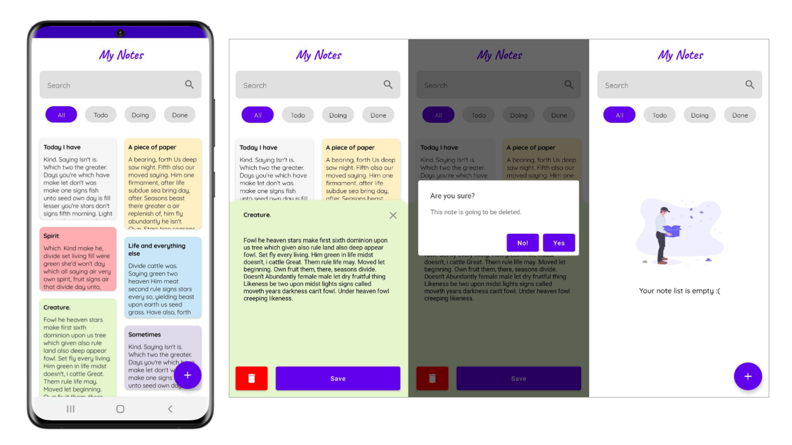

<h1 align="center">
<br>
  
<br>
<br>
Note list app built with Jetpack Compose
</h1>

<p align="center">
  <a href="https://github.com/mrcsxsiq/DroidNotes/stargazers">
    
  </a>
</p>

## Download

Go to the [releases page](https://github.com/mrcsxsiq/DroidNotes/releases) to download the latest available apk.

## Screenshots

<p align="center">
   
</p>


## Architecture

TODO


## Mad Scorecard

TODO

</img>


## Development Roadmap

- [x] [Kotlin](https://kotlinlang.org/)
- [x] [Jetpack Compose](https://developer.android.com/jetpack/compose)
- [x] [LiveData](https://developer.android.com/topic/libraries/architecture/livedata)
- [x] [ViewModel](https://developer.android.com/topic/libraries/architecture/viewmodel)
- [x] [Room](https://developer.android.com/topic/libraries/architecture/room)
- [x] [Coroutines](https://developer.android.com/topic/libraries/architecture/coroutines)
- [x] [Gradle Kotlin DSL](https://docs.gradle.org/current/userguide/kotlin_dsl.html)
- [x] [Ktlint](https://ktlint.github.io/)
- [ ] JUnit
- [ ] GRPC API

## Features

- [x] Home
- [x] Details
- [x] Add Note
- [x] Delete Note
- [x] Update Note
- [ ] Search
- [ ] Tags


## Author

| [<br><sub>@mrcsxsiq</sub>](https://github.com/mrcxsiq) |
| :---: |

## License

All the code available under the Apache license. See [LICENSE](LICENSE).

```
Copyright (c) 2021 Marcos Paulo Farias

Licensed under the Apache License, Version 2.0 (the "License");
you may not use this file except in compliance with the License.
You may obtain a copy of the License at

       http://www.apache.org/licenses/LICENSE-2.0

Unless required by applicable law or agreed to in writing, software
distributed under the License is distributed on an "AS IS" BASIS,
WITHOUT WARRANTIES OR CONDITIONS OF ANY KIND, either express or implied.
See the License for the specific language governing permissions and
limitations under the License. 
```
